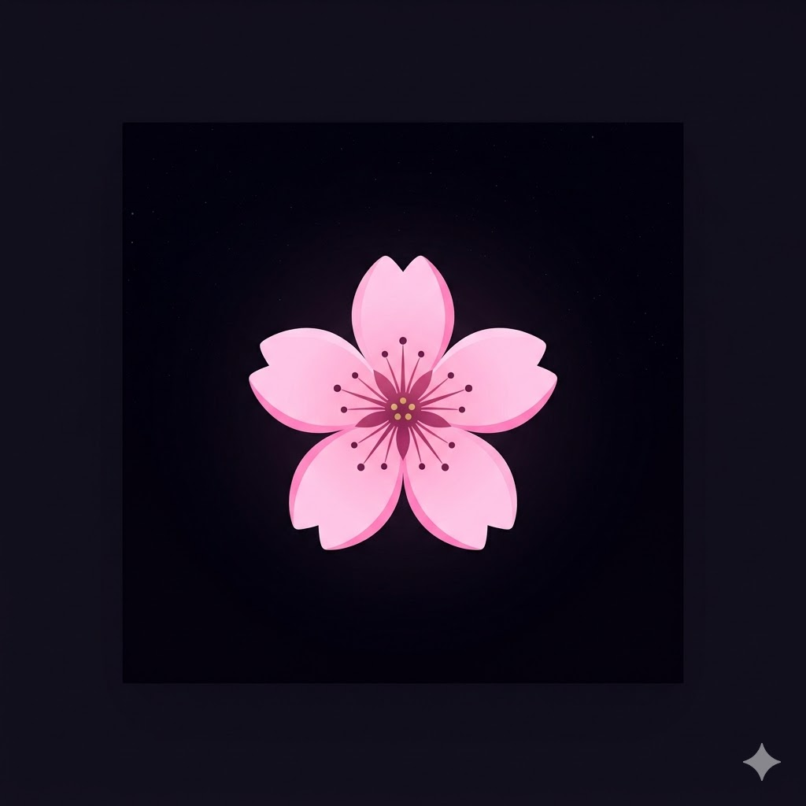

<div align="center">



# Anti-Gravity Pink 🌸

**A dark night mode VS Code theme with dreamy pink aesthetics**


</div>

---

## 📸 Screenshots


---

## ✨ Features

- 🌑 Ultra dark background — easy on the eyes during long coding sessions
- 🌸 Dreamy pink syntax highlighting across all languages
- 🟣 Purple functions and classes for clear visual hierarchy
- ⚪ Pure white variables for maximum contrast
- 🖥️ Full pink terminal with all 16 ANSI colors
- 🔴 Bracket pair colorization in 6 pink shades
- 🐛 Pink debugger, breakpoints and debug console
- 📜 Pink scrollbar and minimap
- ⚠️ Pink styled error and warning indicators
- 🎨 Consistent pink aesthetic across the entire VS Code UI

---

## 🚀 Installation

### Via VS Code Marketplace
1. Open VS Code
2. Press `Ctrl + Shift + X`
3. Search **Anti-Gravity Pink**
4. Click **Install**

### Via Command Line
```bash
code --install-extension hap4114.antigravity-pink
```

### Apply the Theme
1. Press `Ctrl + K` then `Ctrl + T`
2. Select **Anti-Gravity Pink**
3. Enjoy! 🌸

---

## 🎨 Color Palette

| Color | Hex | Used For |
|---|---|---|
| 🔴 Hot Pink | `#FF2D78` | Keywords, operators, errors |
| 🌸 Rose Pink | `#FF6EB4` | Accents, cursors, borders |
| 🟣 Purple | `#D485F5` | Functions, built-ins |
| 💜 Lavender | `#CF6BFF` | Classes, types, Node |
| 🩷 Soft Pink | `#FFB3DE` | Attributes, constants |
| 🤍 Dreamy White | `#FFD6EC` | Strings, values |
| ⚪ White | `#FFFFFF` | Variables, active text |
| 🌑 Dark | `#5a3050` | Comments, inactive |
| 🖤 Background | `#0d0010` | Editor background |

---

## 💻 Supported Languages

| Language | Status |
|---|---|
| JavaScript / TypeScript | ✅ Full support |
| Python | ✅ Full support |
| HTML / CSS | ✅ Full support |
| Java / C++ / C# | ✅ Full support |
| JSON | ✅ Full support |
| SQL | ✅ Full support |
| Shell / Bash | ✅ Full support |
| .env files | ✅ Full support |
| Node.js | ✅ Full support |

---

## 🖥️ Terminal

Fully themed terminal with a complete pink ANSI palette:

| Color | Used For |
|---|---|
| 🔴 `#FF2D78` | Errors, exit codes |
| 🟣 `#D485F5` | Info, cyan output |
| 🌸 `#FF79C6` | Success, green output |
| 🤍 `#FFD6EC` | Normal text |
| ⚪ `#FFFFFF` | Bright text |
| 💜 `#CF6BFF` | Blue directories |

---

## 📁 What Gets Themed

- ✅ Editor and syntax highlighting
- ✅ Terminal with full ANSI colors
- ✅ Sidebar and file explorer
- ✅ Activity bar
- ✅ Status bar
- ✅ Title bar and menu bar
- ✅ Tabs
- ✅ Minimap and scrollbar
- ✅ Debugger and breakpoints
- ✅ Bracket pair colorization
- ✅ Error and warning indicators
- ✅ Git decorations
- ✅ Notifications
- ✅ Input fields and buttons
- ✅ Dropdowns and checkboxes

---

## 🔄 Changelog

### v0.0.2
- Updated README with screenshots and documentation
- Minor version bump

### v0.0.1 — Initial Release
- Full dark pink theme
- Support for 9+ programming languages
- Complete terminal theming
- Bracket pair colorization
- Debugger and breakpoint colors
- Git decoration colors
- Full UI theming

---

## 🤝 Contributing

Found a bug or want to suggest improvements?

1. Fork this repository
2. Create your branch: `git checkout -b feature/improvement`
3. Commit: `git commit -m 'Add improvement'`
4. Push: `git push origin feature/improvement`
5. Open a Pull Request ✅

---

## 📬 Connect with Me

**Himani Anil Patil** — Building VS Code extensions that make your workspace feel like yours.

[](https://www.linkedin.com/in/himani-patil70)
[](https://marketplace.visualstudio.com/publishers/hap4114)
[](mailto:himanipatil4114@gmail.com)

---

## 📄 License

MIT License — © 2026 Himani Anil Patil

Free to use. See [LICENSE](./LICENSE) for full details.

---

<div align="center">

Made with 🌸 by Himani Patil

*If you enjoy this theme please leave a ⭐ rating on the marketplace — it helps a lot!*

</div>
